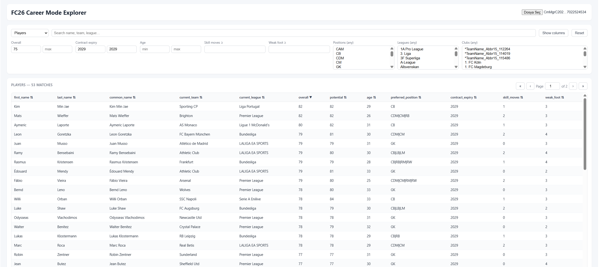

# FC Career Mode Web Parser

This is a [Next.js](https://nextjs.org) project bootstrapped with [`create-next-app`](https://nextjs.org/docs/pages/api-reference/create-next-app).

## Getting Started

First, run the development server:

```bash
npm run dev
# or
yarn dev
# or
pnpm dev
# or
bun dev
```


- /list endpoint takes a career save file starts with "CmMgr", and parses it to join with 3 different player db's which are:
    - https://www.kaggle.com/datasets/flynn28/eafc26-player-database
    - original repo's name list
    - dcplayernames from the save file itself which contains Regens, Live-update arrivals, user edits
- Merges into a db friendly user interface as below
